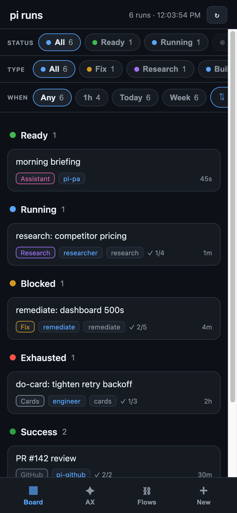
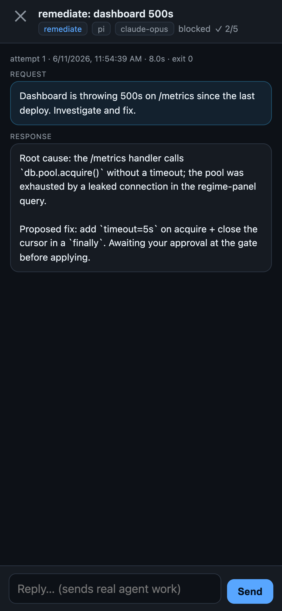
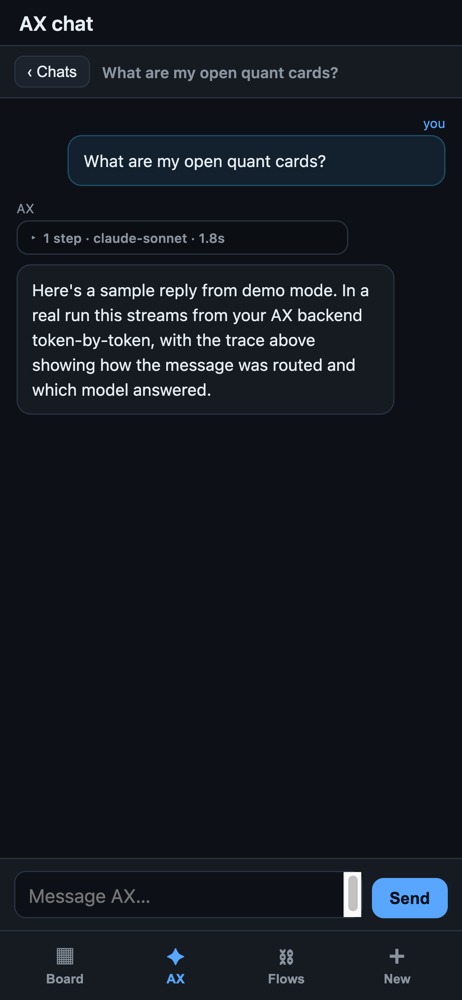
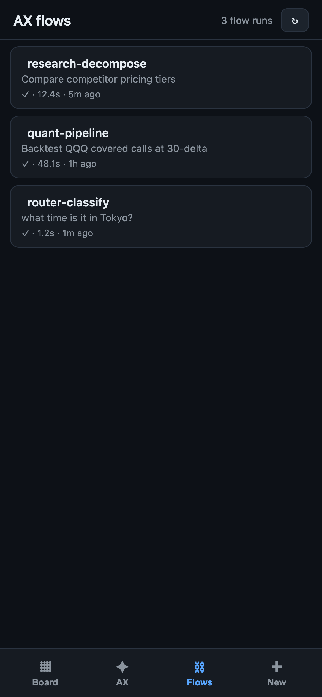

# Agent Mobile PWA

A **one-file mobile PWA** — a phone-friendly board + agent chat that runs on top of an
agent-runner daemon's existing HTTP API. No app store, no build step: a single Python
file (`app.py`) serves an HTTPS web app you add to your iPhone/Android home screen, with
live streaming and push notifications.

> **Note:** this is a front-end. It's wired to a specific agent daemon's `/api` shape and
> shared as a reusable reference — you'll point it at your own backend (or adapt the API
> calls) to run it end to end.

## Screenshots

<p align="center">
  
  
  
  
</p>

<p align="center"><sub>Board · run chat · agent chat with live trace · flow runs — all captured in <code>DEMO=1</code> mode with sample data.</sub></p>

## What it does

- **Board** — your agent runs grouped into status columns, with filters (status / type /
  time window) and sort, all remembered in `localStorage`.
- **Run chat** — tap a run to see its attempts as a conversation, live-streamed over SSE
  while the run is active. Reply to **resume** an idle run or **queue** a follow-up on a
  running one — real governed work, behind a confirm dialog.
- **Agent chat tab** — a separate chat with rejoinable sessions and a live per-turn trace.
- **iPhone push** — Web Push notifications (run finished, gate awaiting approval, reply
  landed) that open the app, implemented with the standard-library crypto only (VAPID +
  AES-GCM), plus a companion `gate-notifier.py` for one-tap Approve/Abort via
  [ntfy](https://ntfy.sh).

## Why it's interesting

- **Single file, ~1.5k lines, near-zero deps** — only `cryptography` (for Web Push).
- **Proxies, doesn't reimplement** — it forwards `/api/*` to the daemon (streaming intact),
  so the phone uses the exact same governed API as everything else.
- **Real Web Push from scratch** — VAPID signing and payload encryption with no push SDK.

## Configuration

Everything is environment variables with localhost defaults — nothing required to start:

| Variable | Default | Purpose |
|---|---|---|
| `PI_DAEMON` | `http://127.0.0.1:4773` | the agent-runner daemon it proxies to |
| `AX_SERVER` | `http://127.0.0.1:8810` | optional agent-chat engine |
| `PI_BOARD_PORT` | `4775` | port to serve on |
| `PI_BOARD_HOST` | `0.0.0.0` | bind address |
| `PI_BOARD_PUBLIC_HOST` | `localhost` | hostname shown in the phone URL |
| `PI_BOARD_TLS` | `./tls/cert` | path prefix to your `*.crt` / `*.key` |
| `VAPID_SUB` | `mailto:you@example.com` | contact for Web Push |

### HTTPS for the phone
Phones require a trusted cert for service workers + push. Easiest path is a
[Tailscale](https://tailscale.com) cert:

```bash
tailscale cert your-host.your-tailnet.ts.net
PI_BOARD_TLS=/path/to/your-host.your-tailnet.ts.net \
PI_BOARD_PUBLIC_HOST=your-host.your-tailnet.ts.net \
python3 app.py
```

Then open `https://your-host…:4775` on the phone and "Add to Home Screen."

## Run

```bash
pip install cryptography
python3 app.py
```

> ⚠️ Sending a reply triggers **real agent work and spend** on your backend.

## Demo mode (no backend needed)

Want to see the UI without wiring up a daemon? Run with `DEMO=1` — it serves canned
sample data (the screenshots above) instead of proxying to a real backend, and falls
back to plain HTTP if you don't have a TLS cert:

```bash
DEMO=1 python3 app.py
# open http://localhost:4775
```

## License

MIT — see [LICENSE](./LICENSE).
